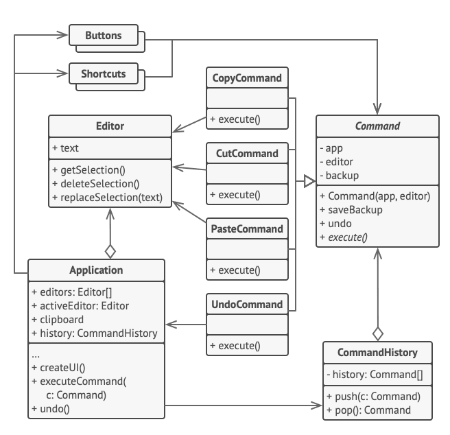

O **Command** é um padrão de projeto comportamental que transforma um pedido em um objeto independente que contém toda a informação sobre o pedido. Essa transformação permite que você parametrize métodos com diferentes pedidos, atrase ou coloque a execução do pedido em uma fila, e suporte operações que não podem ser feitas.

**Command** is a behavioral design pattern that turns a request into a stand-alone object that contains all information about the request. This transformation lets you pass requests as a method arguments, delay or queue a request’s execution, and support undoable operations.

  

[See more](https://refactoring.guru/design-patterns/command) in **Guru Refactoring**.
