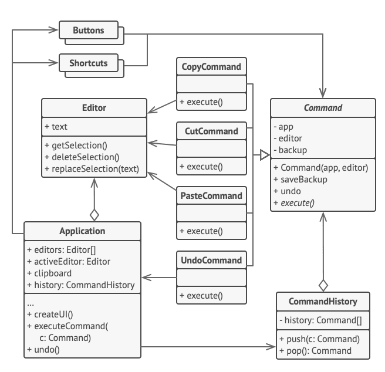

O **Iterator** é um padrão de projeto comportamental que permite a você percorrer elementos de uma coleção sem expor as representações dele (lista, pilha, árvore, etc.)

**Iterator** is a behavioral design pattern that lets you traverse elements of a collection without exposing its underlying representation (list, stack, tree, etc.).

  

[See more](https://refactoring.guru/design-patterns/iterator) in **Guru Refactoring**.
