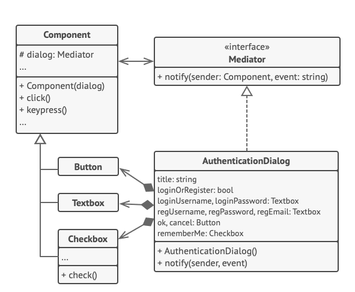

O **Mediator** é um padrão de projeto comportamental que permite que você reduza as dependências caóticas entre objetos. O padrão restringe comunicações diretas entre objetos e os força a colaborar apenas através do objeto mediador.

**Mediator** is a behavioral design pattern that lets you reduce chaotic dependencies between objects. The pattern restricts direct communications between the objects and forces them to collaborate only via a mediator object.

  

[See more](https://refactoring.guru/design-patterns/mediator) in **Guru Refactoring**.
