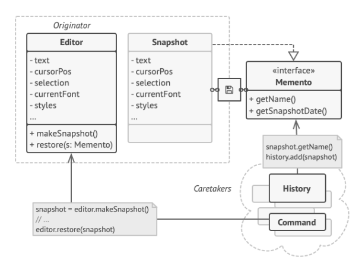

O **Memento** é um padrão de projeto comportamental que permite que você salve e restaure o estado anterior de um objeto sem revelar os detalhes de sua implementação.

**Memento** is a behavioral design pattern that lets you save and restore the previous state of an object without revealing the details of its implementation.

  

[See more](https://refactoring.guru/design-patterns/memento) in **Guru Refactoring**.
