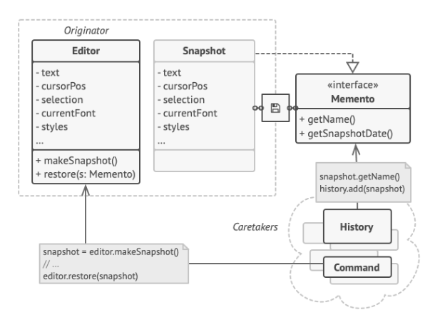

O **Observer** é um padrão de projeto comportamental que permite que você defina um mecanismo de assinatura para notificar múltiplos objetos sobre quaisquer eventos que aconteçam com o objeto que eles estão observando.

**Observer** is a behavioral design pattern that lets you define a subscription mechanism to notify multiple objects about any events that happen to the object they’re observing.

  

[See more](https://refactoring.guru/design-patterns/observer) in **Guru Refactoring**.
