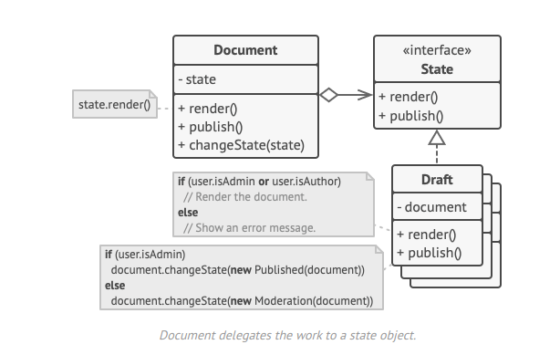

O **State** é um padrão de projeto comportamental que permite que um objeto altere seu comportamento quando seu estado interno muda. Parece como se o objeto mudasse de classe.

**State** is a behavioral design pattern that lets an object alter its behavior when its internal state changes. It appears as if the object changed its class.

  

[See more](https://refactoring.guru/design-patterns/state) in **Guru Refactoring**.
