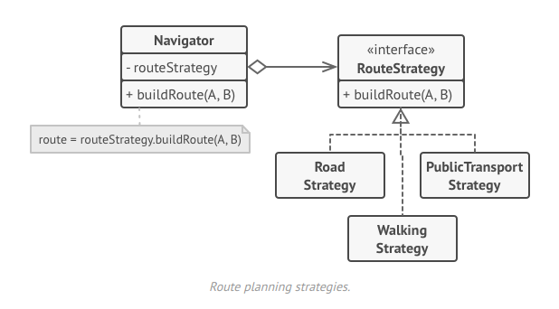

O **Strategy** é um padrão de projeto comportamental que permite que você defina uma família de algoritmos, coloque-os em classes separadas, e faça os objetos deles intercambiáveis.

**Strategy** is a behavioral design pattern that lets you define a family of algorithms, put each of them into a separate class, and make their objects interchangeable.

  

[See more](https://refactoring.guru/design-patterns/strategy) in **Guru Refactoring**.
