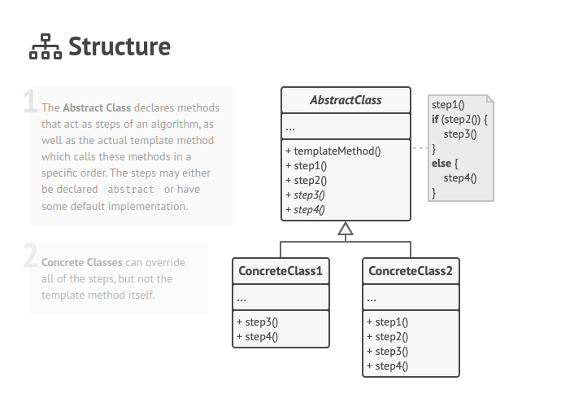

O **Template Method** é um padrão de projeto comportamental que define o esqueleto de um algoritmo na superclasse mas deixa as subclasses sobrescreverem etapas específicas do algoritmo sem modificar sua estrutura.

**Template Method** is a behavioral design pattern that defines the skeleton of an algorithm in the superclass but lets subclasses override specific steps of the algorithm without changing its structure.

  

[See more](https://refactoring.guru/design-patterns/template-method) in **Guru Refactoring**.
