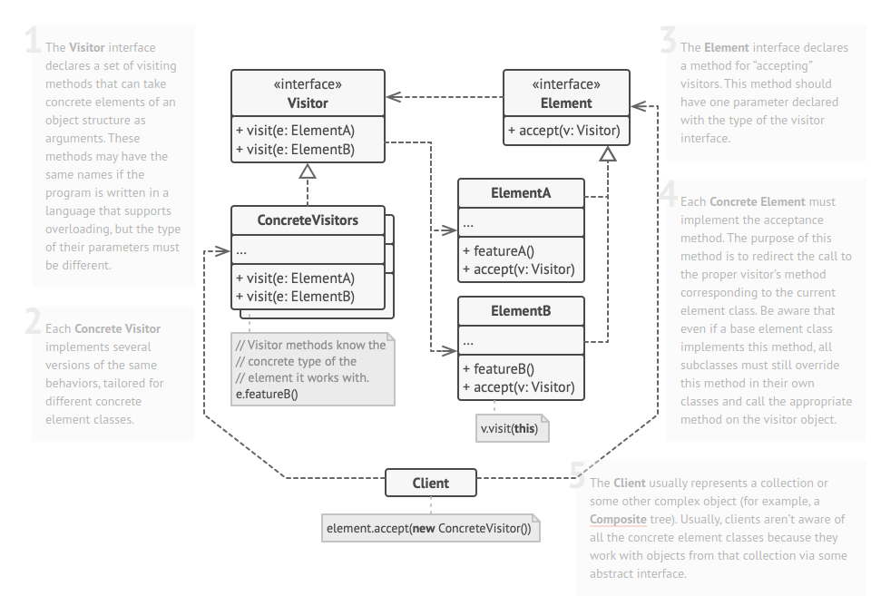

O **Visitor** é um padrão de projeto comportamental que permite que você separe algoritmos dos objetos nos quais eles operam.

**Visitor** is a behavioral design pattern that lets you separate algorithms from the objects on which they operate.

  

[See more](https://refactoring.guru/design-patterns/visitor) in **Guru Refactoring**.
