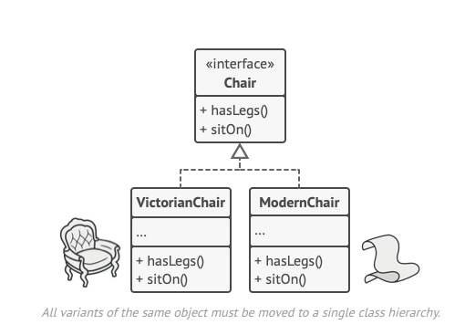
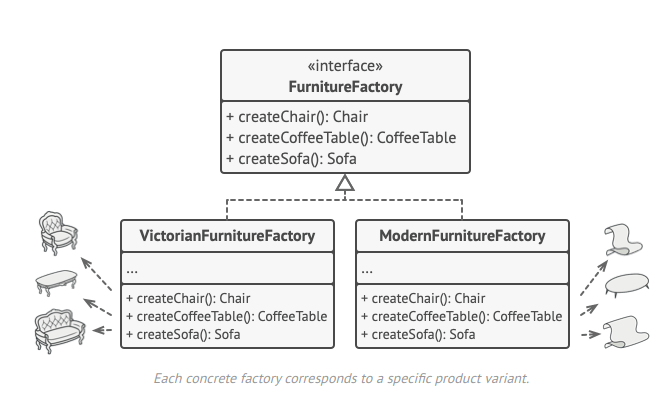

O **Abstract Factory** é um padrão de projeto criacional que permite que você produza famílias de objetos relacionados sem ter que especificar suas classes concretas.

**Abstract Factory** is a creational design pattern that lets you produce families of related objects without specifying their concrete classes.

  
  

[See more](https://refactoring.guru/design-patterns/abstract-factory) in **Guru Refactoring**.
