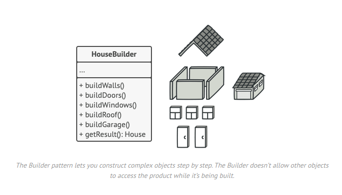

O **Builder** é um padrão de projeto criacional que permite a você construir objetos complexos passo a passo. O padrão permite que você produza diferentes tipos e representações de um objeto usando o mesmo código de construção.

**Builder** is a creational design pattern that lets you construct complex objects step by step. The pattern allows you to produce different types and representations of an object using the same construction code.

  

[See more](https://refactoring.guru/design-patterns/builder) in **Guru Refactoring**.
