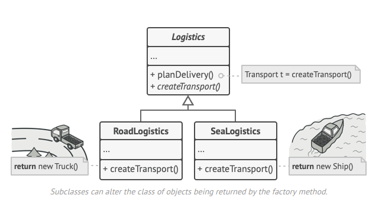

O **Factory Method** é um padrão criacional de projeto que fornece uma interface para criar objetos em uma superclasse, mas permite que as subclasses alterem o tipo de objetos que serão criados

**Factory Method** is a creational design pattern that provides an interface for creating objects in a superclass, but allows subclasses to alter the type of objects that will be created.

  

[See more](https://refactoring.guru/design-patterns/factory-method) in **Guru Refactoring**.
