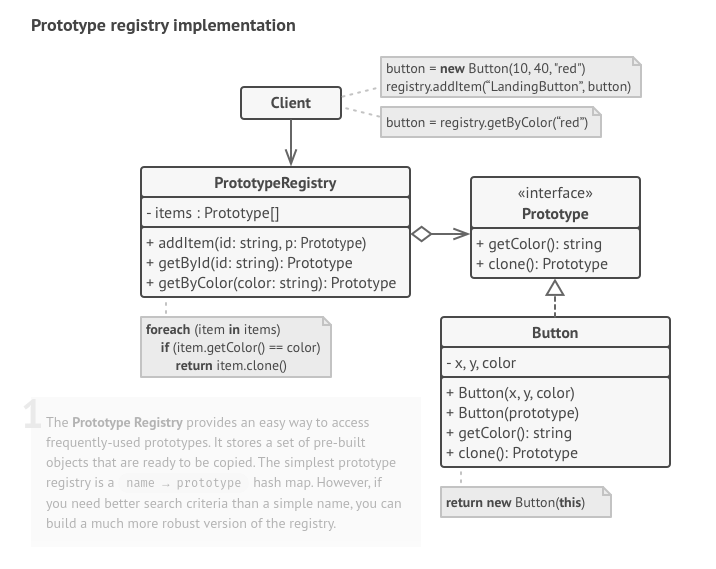

O **Prototype** é um padrão de projeto criacional que permite copiar objetos existentes sem fazer seu código ficar dependente de suas classes.

**Prototype** is a creational design pattern that lets you copy existing objects without making your code dependent on their classes.

  

[See more](https://refactoring.guru/design-patterns/prototype) in **Guru Refactoring**.
