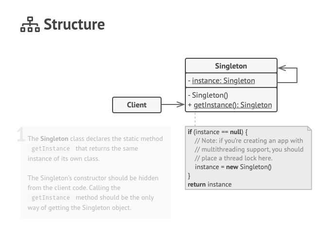

O **Singleton** é um padrão de projeto criacional que permite a você garantir que uma classe tenha apenas uma instância, enquanto provê um ponto de acesso global para essa instância.

**Singleton** is a creational design pattern that lets you ensure that a class has only one instance, while providing a global access point to this instance.

  

[See more](https://refactoring.guru/design-patterns/singleton) in **Guru Refactoring**.
