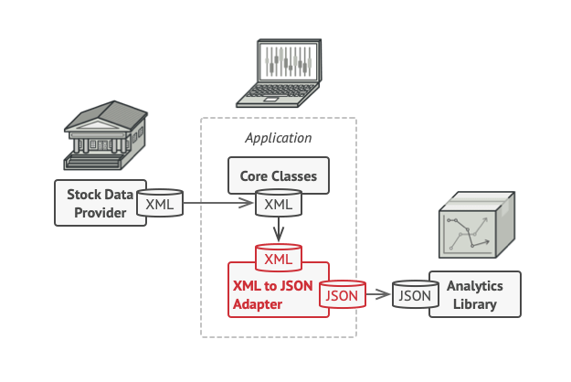

# Adapter

O **Adapter** é um padrão de projeto estrutural que permite objetos com interfaces incompatíveis colaborarem entre si.

**Adapter** is a structural design pattern that allows objects with incompatible interfaces to collaborate.

  

[See more](https://refactoring.guru/design-patterns/adapter) in **Guru Refactoring**.
