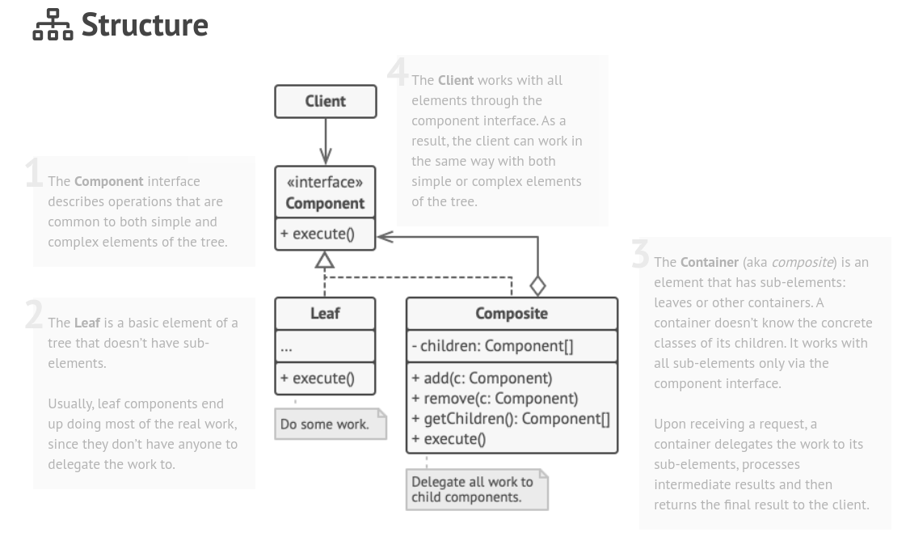

O **Composite** é um padrão de projeto estrutural que permite que você componha objetos em estruturas de árvores e então trabalhe com essas estruturas como se elas fossem objetos individuais.

**Composite** is a structural design pattern that lets you compose objects into tree structures and then work with these structures as if they were individual objects.

  

[See more](https://refactoring.guru/design-patterns/composite) in **Guru Refactoring**.
