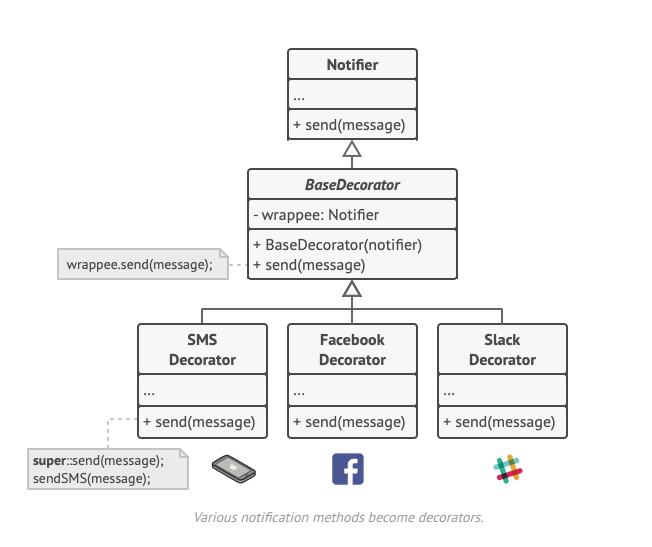

O **Decorator** é um padrão de projeto estrutural que permite que você acople novos comportamentos para objetos ao colocá-los dentro de invólucros de objetos que contém os comportamentos.

**Decorator** is a structural design pattern that lets you attach new behaviors to objects by placing these objects inside special wrapper objects that contain the behaviors.

  

[See more](https://refactoring.guru/design-patterns/decorator) in **Guru Refactoring**.
