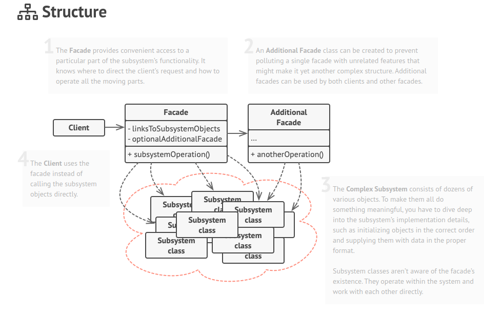

O **Facade** é um padrão de projeto estrutural que fornece uma interface simplificada para uma biblioteca, um framework, ou qualquer conjunto complexo de classes.

**Facade** is a structural design pattern that provides a simplified interface to a library, a framework, or any other complex set of classes.

  

[See more](https://refactoring.guru/design-patterns/facade) in **Guru Refactoring**.
