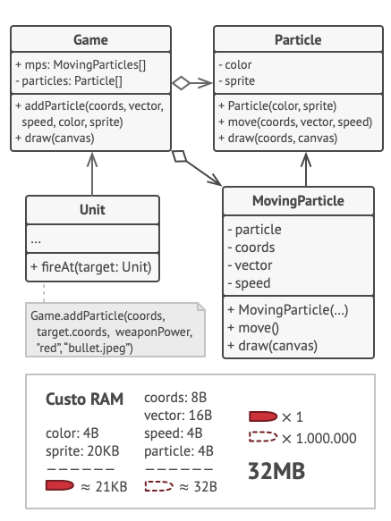

O **Flyweight** é um padrão de projeto estrutural que permite a você colocar mais objetos na quantidade de RAM disponível ao compartilhar partes comuns de estado entre os múltiplos objetos ao invés de manter todos os dados em cada objeto.

**Flyweight** is a structural design pattern that lets you fit more objects into the available amount of RAM by sharing common parts of state between multiple objects instead of keeping all of the data in each object.

  

[See more](https://refactoring.guru/design-patterns/flyweight) in **Guru Refactoring**.
