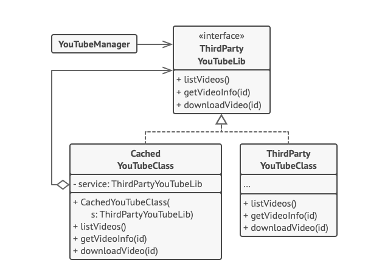

O **Proxy** é um padrão de projeto estrutural que permite que você forneça um substituto ou um espaço reservado para outro objeto. Um proxy controla o acesso ao objeto original, permitindo que você faça algo ou antes ou depois do pedido chegar ao objeto original.

**Proxy** is a structural design pattern that lets you provide a substitute or placeholder for another object. A proxy controls access to the original object, allowing you to perform something either before or after the request gets through to the original object.

  

[See more](https://refactoring.guru/design-patterns/proxy) in **Guru Refactoring**.
